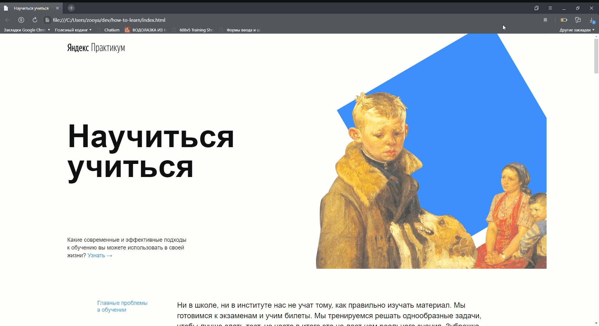

# How to Learn 
***

Проект содержит образовательные ресурсы (ссылки и статьи) для оптимизации обучения во время курса.
В проекте реализованы анимации, простые преобразования и используется технология BEM-Nested.
***

Анимации вращения реализованы через фреймы:
~~~
@keyframes rotation {
    from {
        transform: rotate(0deg);
    }
    to {
        transform: rotate(360deg);
    }
} 

.rotation {
    animation: rotation 20s linear infinite;
}
~~~

Простые трансформации для ссылок с использованием CSS:
~~~
.link-animation:hover{
    opacity: 0.4;
    transition: 0.35s linear 0.001s;
}
~~~

